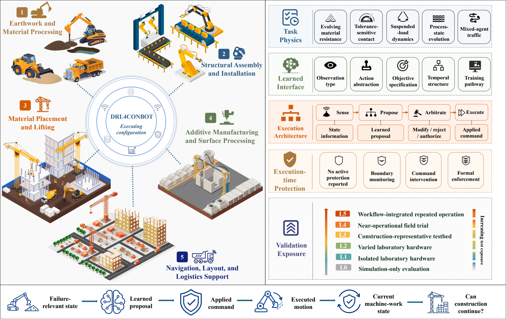
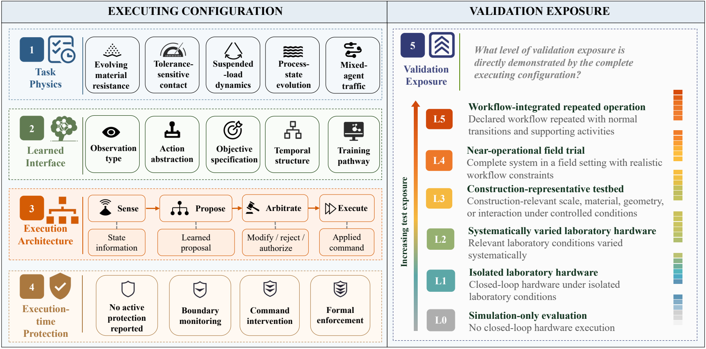
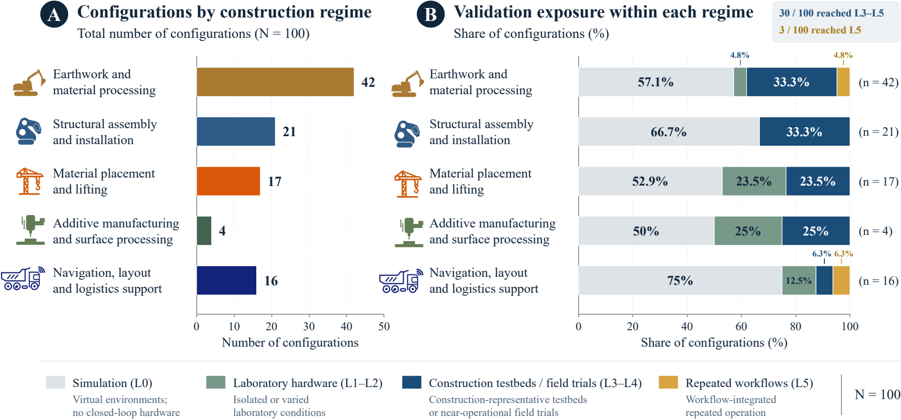
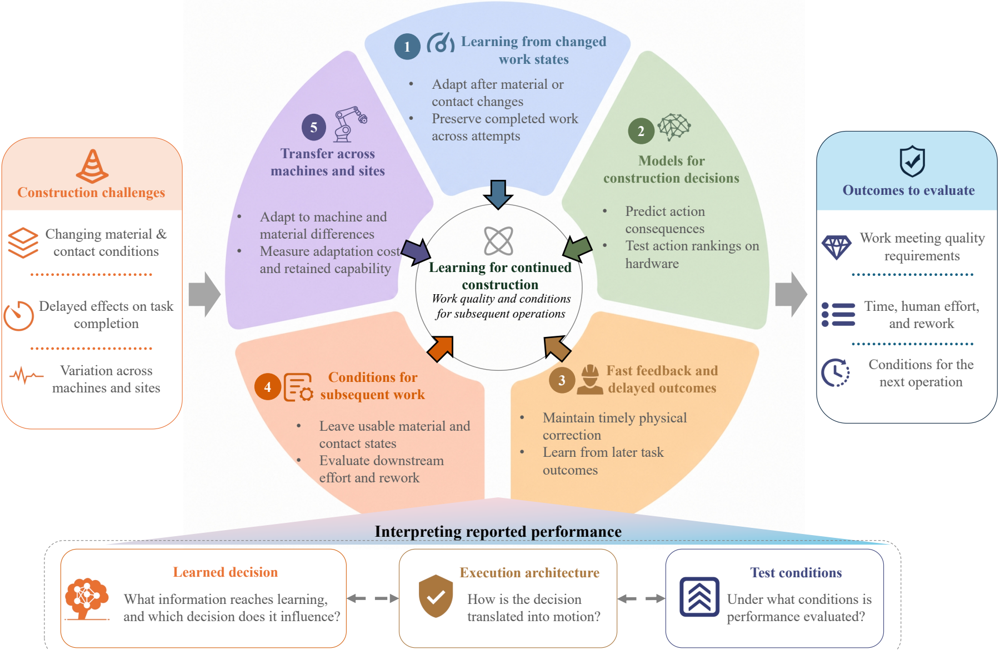

# Learning to Shape the World: A Systematic Review of Deep Reinforcement Learning for Construction Robotics

<p align="center">
  <a href="Assets/overview/graphical-abstract.pdf"></a>
</p>

<p align="center"><em>Graphical abstract of the DRL4CONBOT survey.</em></p>

> A curated collection of papers and research resources related to **Deep Reinforcement Learning for Construction Robotics (DRL4CONBOT)**.
>
> This repository serves as the online companion to our survey **Learning to Shape the World: A Systematic Review of Deep Reinforcement Learning for Construction Robotics**. The review synthesizes 136 eligible reports and compares 100 executing configurations across five construction task regimes.
>
> 📢 Deep reinforcement learning offers opportunities to improve construction decisions through experience with materials, machines, and changing workspaces. This repository brings together research on learning formulations, robot execution, and construction outcomes, serving as a resource for researchers, practitioners, and students interested in construction robot learning. Contributions and suggestions are welcome!
>
> Feel free to contact us with suggestions or research questions by e-mail: [zekai.jin@mail.mcgill.ca](mailto:zekai.jin@mail.mcgill.ca), [yi.shao@ubc.ca](mailto:yi.shao@ubc.ca).

## Table of Contents

- [🔥 News & Updates](#news-updates)
- [📚 Papers by Category](#papers-by-category)
  - [Earthwork and Material Processing](#earthwork)
  - [Structural Assembly and Installation](#assembly)
  - [Material Placement and Lifting](#lifting)
  - [Additive Manufacturing and Surface Processing](#fabrication)
  - [Navigation, Layout, and Logistics Support](#navigation)
  - [Additional Contextual Reports](#additional-contextual)
- [📖 Framework and Taxonomy](#overview)
- [Five Construction Regimes](#five-construction-regimes)
- [📊 Evidence at a Glance](#evidence-at-a-glance)
- [💡 Research Directions](#research-directions)
- [Resources](#resources)
- [Review Data and Reproducibility](#review-data-and-reproducibility)
- [Citation](#citation)
- [Contributing and Contact](#contributing-and-contact)

## Review Data and Reproducibility

The [supplementary data and analysis package](Supplementary/README.md) provides search strategies, screening decisions, report and configuration data, recovery source pointers, and a script for reproducing the descriptive statistics. It covers **136 eligible reports and 100 executing configurations**. Original database exports and abstracts are not redistributed. The package documents the scope and limitations of the available records.

<a id="news-updates"></a>

## 🔥 News & Updates

- ✅ **[June 2026] Repository Launch:** The `DRL4CONBOTS` companion repository was initialized.

<a id="papers-by-category"></a>

## 📚 Papers by Category

The complete eligible corpus is listed below: **136 reports**, comprising **101 structured-comparison reports** and **35 contextual reports**. The structured reports describe **100 executing configurations**, after consolidating one companion-report pair.

Papers are organized using the five construction task regimes in the review. **Structured** and **Contextual** identify their evidence roles; contextual reports do not enter the configuration-level statistics. Each report appears once. Cross-regime references retain a note, and reports without an explicit regime mapping in the extraction or appendix are listed separately rather than assigned a new classification.

<a id="earthwork"></a>

### Earthwork and Material Processing

**51 reports** · 43 structured · 8 contextual

- [Solving robotics tasks with prior demonstration via exploration-efficient deep reinforcement learning](https://doi.org/10.3389/frobt.2025.1682200). **2026** · Structured · `R037`.
- [Reinforcement learning-driven adaptive 3D simulation and visualization of excavator operations](https://doi.org/10.1016/j.autcon.2025.106626). **2026** · Contextual · `R053`.
- [Large-Scale Robotic Material Handling: Learning, Planning, and Control](https://doi.org/10.1109/tfr.2026.3662619). **2026** · Structured · `R038`.
- [Intelligent attitude control in tunnel boring machine considering uncertain underground environment using deep reinforcement learning](https://doi.org/10.1016/j.asoc.2025.114285). **2026** · Structured · `R040`.
- [Hybrid deep reinforcement learning with generative data augmentation for TBM trajectory deviation control](https://doi.org/10.1016/j.autcon.2026.107029). **2026** · Structured · `R138`.
- [Digital twin–enabled real-time control of tunnel boring machines using deep reinforcement learning for cumulative settlement management](https://doi.org/10.1016/j.autcon.2025.106725). **2026** · Structured · `R039`.
- [Data-driven rock capture with a standard excavator via model-free reinforcement learning](https://doi.org/10.1016/j.autcon.2026.106869). **2026** · Structured · `R050`.
- [Collaborative learning architecture for autonomous excavator planning and execution](https://doi.org/10.1016/j.autcon.2025.106742). **2026** · Structured · `R035`.
- [Bayesian reinforcement learning for adaptive control of energy recuperation in hydraulic excavator arms](https://doi.org/10.1038/s41598-026-35391-y). **2026** · Contextual · `R048`.
- [Adaptive TBM deviation correction with deep reinforcement learning considering physical constraints](https://doi.org/10.1016/j.autcon.2026.107036). **2026** · Structured · `R139`.
- [A hierarchical partially observable Markov decision process framework for tunnel boring machine trajectory navigation](https://doi.org/10.1016/j.engappai.2025.113663). **2026** · Contextual · `R051`.
- [Towards Learning Boulder Excavation with Hydraulic Excavators](https://doi.org/10.48550/arxiv.2509.17683). **2025** · Structured · `R026`.
- [Time-optimal online trajectory planning for excavator robotics based on reinforcement learning](https://doi.org/10.1177/16878132251370408). **2025** · Structured · `R034`.
- [Safe reinforcement learning for tracking control of uncertain hydraulic excavators](https://doi.org/10.1007/s11071-025-11500-w). **2025** · Structured · `R025`.
- [Reinforcement learning-based trajectory planning for continuous digging of excavator working devices in trenching tasks](https://doi.org/10.1111/mice.13428). **2025** · Structured · `R033`.
- [Reinforcement Learning-Based Autonomous Control Methodology of Hydraulic Excavators](https://doi.org/10.1109/iros60139.2025.11247184). **2025** · Structured · `R027`.
- [Reinforcement Learning with World Models for Autonomous Excavation Optimization in Wheel Loaders](https://doi.org/10.1016/j.ifacol.2025.12.184). **2025** · Contextual · `R046`.
- [Progressive-Resolution Policy Distillation: Leveraging Coarse-Resolution Simulations for Time-Efficient Fine-Resolution Policy Learning](https://doi.org/10.1109/tase.2025.3590068). **2025** · Structured · `R028`.
- [Human-in-the-Loop Reinforcement Learning to Track Excavation Paths for a Hydraulic Excavator in a Short Period of Time](https://doi.org/10.1109/access.2025.3585182). **2025** · Structured · `R030`.
- [Enhanced Hydraulic Excavator Control via Semi-automatic Grading Control Using Reinforcement Learning](https://doi.org/10.1007/s12555-024-0213-9). **2025** · Structured · `R029`.
- [Cooperative Work Simulation of Construction Equipment using Multi-Agent Deep Reinforcement Learning](https://doi.org/10.1109/aihcir67580.2025.11405210). **2025** · Contextual · `R045`.
- [Autonomous loading of ore piles with Load-Haul-Dump machines using deep reinforcement learning](https://doi.org/10.1016/j.eswa.2024.125770). **2025** · Contextual · `R047`.
- [Adaptive Excavation Automation in Complex Soil Environments Using Reinforcement Learning](https://doi.org/10.1109/tase.2025.3611032). **2025** · Structured · `R032`.
- [Task Space Control of Hydraulic Construction Machines Using Reinforcement Learning](https://doi.org/10.1007/978-3-031-55000-3_13). **2024** · Structured · `R019`.
- [Simulation of Coherent Excavator Operations in Earthmoving Tasks Based on Reinforcement Learning](https://doi.org/10.3390/buildings14103270). **2024** · Structured · `R144`.
- [Reinforcement Learning-Based Bucket Filling for Autonomous Excavation](https://doi.org/10.1109/tfr.2024.3432508). **2024** · Structured · `R016`.
- [Reinforcement Learning Control for Autonomous Hydraulic Material Handling Machines with Underactuated Tools](https://doi.org/10.1109/iros58592.2024.10802199). **2024** · Structured · `R044`.
- [Physics-informed deep reinforcement learning for enhancement on tunnel boring machine's advance speed and stability](https://doi.org/10.1016/j.autcon.2023.105234). **2024** · Structured · `R020`.
- [Optimizing bucket-filling strategies for wheel loaders inside a dream environment](https://doi.org/10.1016/j.autcon.2024.105804). **2024** · Structured · `R018`.
- [Learning Adaptive Controller for Hydraulic Machinery Automation](https://doi.org/10.1109/LRA.2024.3372831). **2024** · Structured · `R160`.
- [Generalized Framework for Wheel Loader Automatic Shoveling Task with Expert Initialized Reinforcement Learning](https://doi.org/10.1109/sii58957.2024.10417575). **2024** · Structured · `R023`.
- [Autonomous collaborative optimization control of earth pressure balance shield machine based on hierarchical control architecture](https://doi.org/10.1016/j.engappai.2024.109200). **2024** · Structured · `R148`.
- [Automatic Loading of Unknown Material with a Wheel Loader Using Reinforcement Learning](https://doi.org/10.1109/icra57147.2024.10610221). **2024** · Structured · `R017`.
- [Automated position control of tunnel boring machine during excavation using deep reinforcement learning](https://doi.org/10.1016/j.asoc.2024.112234). **2024** · Structured · `R021`.
- [3d operation of autonomous excavator based on reinforcement learning through independent reward for individual joints](https://doi.org/10.48550/arxiv.2406.19848). **2024** · Structured · `R024`.
- [Learning excavation of rigid objects with offline reinforcement learning](https://doi.org/10.48550/arxiv.2303.16427). **2023** · Structured · `R012`.
- [Learning Adaptive Policies for Autonomous Excavation under Various Soil Conditions by Adversarial Domain Sampling](https://doi.org/10.1109/lra.2023.3296933). **2023** · Structured · `R013`.
- [Coordinated Tuning of Slurry Shield Control Parameters based on Reinforcement Learning](https://doi.org/10.1109/icrae59816.2023.10458482). **2023** · Structured · `R151`.
- [Autonomous Pick-and-Place Using Excavator Based on Deep Reinforcement Learning](https://doi.org/10.1109/icitee59582.2023.10317662). **2023** · Structured · `R011`.
- [Towards autonomous and optimal excavation of shield machine: a deep reinforcement learning-based approach; [题目:迈向盾构机自主最优掘进:一种基于深度强化学习的方法]](https://doi.org/10.1631/jzus.a2100325). **2022** · Structured · `R009`.
- [Soil-Adaptive Excavation Using Reinforcement Learning](https://doi.org/10.1109/lra.2022.3189834). **2022** · Structured · `R004`.
- [Excavation Reinforcement Learning Using Geometric Representation](https://doi.org/10.1109/lra.2022.3150511). **2022** · Structured · `R006`.
- [Deep Reinforcement Learning with Adversarial Training for Automated Excavation Using Depth Images](https://doi.org/10.1109/access.2022.3140781). **2022** · Structured · `R007`.
- [AGPNet – Autonomous Grading Policy Network](https://doi.org/10.22260/ICRA2022/0013). **2022** · Structured · `R008`.
- [A General Approach for the Automation of Hydraulic Excavator Arms Using Reinforcement Learning](https://doi.org/10.1109/lra.2022.3152865). **2022** · Structured · `R005`.
- [Wheel Loader Scooping Controller Using Deep Reinforcement Learning](https://doi.org/10.1109/access.2021.3056625). **2021** · Contextual · `R043`.
- [Route optimization for autonomous bulldozer by distributed deep reinforcement learning](https://doi.org/10.1109/icm46511.2021.9385686). **2021** · Structured · `R003`.
- Simulation-based Reinforcement Learning Approach towards Construction Machine Automation. **2020** · Structured · `R002`.
- [Automated Excavator Based on Reinforcement Learning and Multibody System Dynamics](https://doi.org/10.1109/access.2020.3040246). **2020** · Contextual · `R042`.
- [Optimal routing control of a construction machine by deep reinforcement learning](https://doi.org/10.1109/amc.2019.8371085). **2018** · Structured · `R041`.
- [Autonomous grading work using deep reinforcement learning based control](https://doi.org/10.1109/iecon.2018.8591189). **2018** · Structured · `R001`.

<a id="assembly"></a>

### Structural Assembly and Installation

**27 reports** · 21 structured · 6 contextual

- [Sample-Efficient Robot Skill Learning for Construction Tasks: Benchmarking Hierarchical Reinforcement Learning and Vision-Language-Action Model](https://doi.org/10.1061/jccee5.cpeng-7696). **2026** · Structured · `R136`.
- [Mixed reality and machine learning-guided cable robot framework (MMCR) for real-time prefabricated construction automation](https://doi.org/10.1016/j.aei.2026.104580). **2026** · Structured · `R072`.
- [Harnessing human expertise for high-precision robotic assembly in industrialized construction: A sample-efficient installer-in-the-loop interactive reinforcement learning framework](https://doi.org/10.1016/j.aei.2026.104823). **2026** · Structured · `R071`.
- [Visual–tactile learning of robotic cable-in-duct installation skills](https://doi.org/10.1016/j.autcon.2024.105905). **2025** · Structured · `R067`.
- [Training of construction robots using imitation learning and environmental rewards](https://doi.org/10.1111/mice.13394). **2025** · Structured · `R066`.
- [Teaching Robot End Effectors to Grasp Construction Tools Based on Deep Reinforcement Learning](https://doi.org/10.29007/ft8h). **2025** · Structured · `R070`.
- [Synchronous control of multiple hydraulic cylinders in aerial building machine using improved deep reinforcement learning](https://doi.org/10.1016/j.autcon.2025.106448). **2025** · Structured · `R080`.
- [Reinforcement Learning-Based Motion Planning for Robotic Bricklaying in Construction Environments](https://doi.org/10.1061/9780784486443.068). **2025** · Structured · `R069`.
- [Reinforcement Learning with Vision-based State Estimation for Generalized Robotic Assembly](https://doi.org/10.22260/isarc2025/0025). **2025** · Contextual · `R078`.
- Reinforcement Learning Assisted Robotic Construction for Masonry Block Dry-Stacking in Simulation Environments. **2025** · Contextual · `R079`.
- [Cutaway View Learning for Visually-Guided Assembly with Crane](https://doi.org/10.1109/case58245.2025.11163919). **2025** · Structured · `R068`.
- Construction Robot Skill Learning for Fragile Object Installation with Low-Effort Demonstration and Sample-Efficient Hierarchical Reinforcement Learning Models. **2025** · Contextual · `R077`.
- [Substructure-Preserving Generalization for on-site robotic construction planning](https://doi.org/10.1109/iscipt61983.2024.10672942). **2024** · Contextual · `R076`.
- [Visual Spatial Attention and Proprioceptive Data-Driven Reinforcement Learning for Robust Peg-in-Hole Task Under Variable Conditions](https://doi.org/10.1109/lra.2023.3243526). **2023** · Structured · `R065`.
- [To imitate or not to imitate: Boosting reinforcement learning-based construction robotic control for long-horizon tasks using virtual demonstrations](https://doi.org/10.1016/j.autcon.2022.104691). **2023** · Structured · `R062`.
- [Reinforcement Learning-based Virtual Fixtures for Teleoperation of Hydraulic Construction Machine∗](https://doi.org/10.1109/ro-man57019.2023.10309417). **2023** · Structured · `R063`.
- [Experimental Digital Twin of a Tunnel Ring Building Erector](https://doi.org/10.1109/eurocon56442.2023.10198935). **2023** · Contextual · `R075`.
- [Enhancing construction robot learning for collaborative and long-horizon tasks using generative adversarial imitation learning](https://doi.org/10.1016/j.aei.2023.102140). **2023** · Structured · `R064`.
- [Dexterous manipulation of construction tools using anthropomorphic robotic hand](https://doi.org/10.1016/j.autcon.2023.105133). **2023** · Structured · `R061`.
- [An Integrated Approach Combining Virtual Environments and Reinforcement Learning to Train Construction Robots for Conducting Tasks Under Uncertainties](https://doi.org/10.1007/978-3-031-34593-7_17). **2023** · Structured · `R154`.
- [Robotic architectural assembly with tactile skills: Simulation and optimization](https://doi.org/10.1016/j.autcon.2021.104006). **2022** · Structured · `R056`.
- [Learning robotic manipulation of natural materials with variable properties for construction tasks](https://doi.org/10.1109/lra.2022.3159288). **2022** · Structured · `R060`.
- [Deep reinforcement learning-based construction robots collaboration for sequential tasks](https://doi.org/10.22260/icra2022/0015). **2022** · Structured · `R059`.
- [A reinforcement learning based approach for conducting multiple tasks using robots in virtual construction environments](https://doi.org/10.22260/icra2022/0014). **2022** · Structured · `R057`.
- [Robotic assembly of timber joints using reinforcement learning](https://doi.org/10.1016/j.autcon.2021.103569). **2021** · Structured · `R055`.
- [Teaching robots to perform quasi-repetitive construction tasks through human demonstration](https://doi.org/10.1016/j.autcon.2020.103370). **2020** · Structured · `R054`.
- [Slabstone installation skill acquisition for dual-arm robot based on reinforcement learning](https://doi.org/10.1109/robio49542.2019.8961805). **2019** · Contextual · `R073`.

<a id="lifting"></a>

### Material Placement and Lifting

**21 reports** · 17 structured · 4 contextual

- [TD3-Enhanced MPC for Safe Braking of Overhead Cranes with Safety-Critical Region Prediction](https://doi.org/10.3390/act15060334). **2026** · Structured · `R141`.
- [Large Language Model and Reinforcement Learning Based Autonomous Construction and Progress Updates](https://doi.org/10.1109/acdsa67686.2026.11468021). **2026** · Structured · `R108`.
- [Development and Implementation of Machine Learning–Based Hierarchical Approach for Autonomous Retaining Wall Construction Using a Robotized Crane](https://doi.org/10.1061/jccee5.cpeng-7293). **2026** · Structured · `R109`.
- [A reinforcement learning and nonlinear adaptive backstepping hierarchical control for autonomous remote construction using 5G network](https://doi.org/10.1016/j.cacaie.2026.100013). **2026** · Structured · `R091`.
- [Safe reinforcement learning-based control using deep deterministic policy gradient algorithm and slime mould algorithm with experimental tower crane system validation](https://doi.org/10.1016/j.ins.2024.121640). **2025** · Structured · `R103`.
- [Deep Reinforcement Learning for Tower Crane Layout Planning in Dense Multi-Building Sites](https://doi.org/10.1109/aihcir67580.2025.11404849). **2025** · Structured · `R088`.
- [Autonomous construction framework for crane control with enhanced soft actor–critic algorithm and real-time progress monitoring](https://doi.org/10.1111/mice.13427). **2025** · Structured · `R090`.
- [AUTONOMOUS MODULAR CONSTRUCTION STRATEGY USING ROBOTIZED CRANE BASED ON DEEP LEARNING AND REINFORCEMENT LEARNING](https://doi.org/10.3846/jcem.2025.24043). **2025** · Structured · `R089`.
- [Integrated reinforcement and imitation learning for tower crane lift path planning](https://doi.org/10.1016/j.autcon.2024.105568). **2024** · Structured · `R087`.
- [Deep reinforcement learning based online lifting path planning for tower cranes in unknown dynamic environments](https://doi.org/10.1177/17298806241283176). **2024** · Structured · `R099`.
- [Deep Reinforcement Learning-Based Control for Asynchronous Motor-Actuated Triple Pendulum Crane Systems with Distributed Mass Payloads](https://doi.org/10.1109/tie.2023.3262891). **2024** · Contextual · `R097`.
- [Adaptive reinforcement learning-based control using proximal policy optimization and slime mould algorithm with experimental tower crane system validation](https://doi.org/10.1016/j.asoc.2024.111687). **2024** · Structured · `R100`.
- [A new concept for large additive manufacturing in construction: tower crane-based 3D printing controlled by deep reinforcement learning](https://doi.org/10.1108/ci-10-2022-0278). **2024** · Structured · `R112`.
- [Zero-Shot Sim2Real Transfer of Deep Reinforcement Learning Controller for Tower Crane System](https://doi.org/10.1016/j.ifacol.2023.10.867). **2023** · Structured · `R096`.
- [A reinforcement learning based construction material supply strategy using robotic crane and computer vision for building reconstruction after an earthquake](https://doi.org/10.48550/arXiv.2308.16280). **2023** · Structured · `R159`.
- [Reinforcement learning-based simulation and automation for tower crane 3D lift planning](https://doi.org/10.1016/j.autcon.2022.104620). **2022** · Structured · `R084`.
- [Reinforcement Learning-Based Transportation and Sway Suppression Methods for Gantry Cranes in Simulated Environment](https://doi.org/10.1109/wsc57314.2022.10015415). **2022** · Contextual · `R094`.
- [Automation of crane control for block lifting based on deep reinforcement learning](https://doi.org/10.1093/jcde/qwac063). **2022** · Contextual · `R093`.
- [A Real-time Smooth Lifting Path Planning for Tower Crane Based on TD3 with Discrete-Continuous Hybrid Action Space](https://doi.org/10.1145/3547578.3547592). **2022** · Structured · `R095`.
- [Real-time Obstacles Avoidance for Crawler Crane based on DQN](https://doi.org/10.1145/3474963.3474993). **2021** · Contextual · `R092`.
- Accuracy and Generality of Trained Models for Lift Planning Using Deep Reinforcement Learning-Optimization of the Crane Hook Movement between Two Points. **2020** · Structured · `R083`.

<a id="fabrication"></a>

### Additive Manufacturing and Surface Processing

**4 reports** · 4 structured · 0 contextual

- [Trajectory Planning for a Spraying Robotic Arm Using a Digital Twin and an Improved SAC Algorithm](https://doi.org/10.3390/s26134285). **2026** · Structured · `R113`.
- [A perception-to-control computational pipeline for humanoid robot-based construction surface finishing via attention-based normal refinement and residual reinforcement learning](https://doi.org/10.1016/j.cacaie.2026.100168). **2026** · Structured · `R142`.
- [Reinforcement learning-based continuous path planning and automated concrete 3D printing of complex hollow components](https://doi.org/10.1016/j.autcon.2025.106290). **2025** · Structured · `R111`.
- [Autonomous robotic additive manufacturing through distributed model-free deep reinforcement learning in computational design environments](https://doi.org/10.1007/s41693-022-00069-0). **2022** · Structured · `R110`.

<a id="navigation"></a>

### Navigation, Layout, and Logistics Support

**21 reports** · 16 structured · 5 contextual

- [Safety-aware predictive motion planning for close-range human-UAV collaboration in construction](https://doi.org/10.1016/j.autcon.2026.106771). **2026** · Structured · `R127`.
- [Path planning for UAV-based construction safety inspection under spatiotemporal interference from tower cranes](https://doi.org/10.1016/j.autcon.2026.106762). **2026** · Structured · `R125`.
- [Deep reinforcement learning coupled with topological scene graph for dynamic path planning of autonomous bulldozer in complex earthwork construction](https://doi.org/10.1016/j.autcon.2025.106617). **2026** · Structured · `R126`.
- [Vision-based Control for Excavator Navigation Using Deep Reinforcement Learning](https://doi.org/10.1109/aims66189.2025.11229794). **2025** · Structured · `R123`.
- [Stepping Locomotion for a Walking Excavator Robot using Hierarchical Reinforcement Learning and Action Masking](https://doi.org/10.1109/iros60139.2025.11247348). **2025** · Structured · `R120`.
- [Safety-constrained Deep Reinforcement Learning control for human–robot collaboration in construction](https://doi.org/10.1016/j.autcon.2025.106130). **2025** · Structured · `R122`.
- [SLAM-Assisted Transformer-Based TD3 Deep Reinforcement Learning for Adaptive Navigation and Mapping and Dynamic Obstacle Avoidance in Autonomous Construction Robotics](https://doi.org/10.1061/9780784486443.057). **2025** · Contextual · `R133`.
- [Robot in the loop: a human-centered approach to contextualizing AI and robotics in construction](https://doi.org/10.1007/s41693-024-00144-8). **2025** · Structured · `R124`.
- [Navigating Vision-based Autonomous Excavator Robot Using Deep Reinforcement Learning](https://doi.org/10.1109/eecsi67060.2025.11290309). **2025** · Structured · `R131`.
- [Enhancing construction robot collaboration via multiagent reinforcement learning](https://doi.org/10.26599/jic.2025.9180089). **2025** · Structured · `R121`.
- [Autonomous Wheel Loader Navigation Using Goal-Conditioned Actor-Critic MPC](https://doi.org/10.1109/icra55743.2025.11127375). **2025** · Contextual · `R132`.
- [Synchronized path planning and tracking for front and rear axles in articulated wheel loaders](https://doi.org/10.1016/j.autcon.2024.105538). **2024** · Structured · `R118`.
- [Adaptive Intelligence for Robot Navigation Efficiency with a Deep Reinforcement Learning-Based Cyber-Physical System](https://doi.org/10.1061/9780784486115.088). **2024** · Structured · `R119`.
- [Prediction-Based Path Planning for Safe and Efficient Human-Robot Collaboration in Construction via Deep Reinforcement Learning](https://doi.org/10.1061/(asce)cp.1943-5487.0001056). **2023** · Structured · `R116`.
- [Deep Reinforcement Learning-based Task Assignment and Path Planning for Multi-agent Construction Robots](https://doi.org/10.22260/icra2023/0008). **2023** · Structured · `R117`.
- [Autonomous Navigation of Wheel Loaders using Task Decomposition and Reinforcement Learning](https://doi.org/10.1109/case56687.2023.10260481). **2023** · Contextual · `R130`.
- [Study on the Autonomous Walking of an Underground Definite Route LHD Machine Based on Reinforcement Learning](https://doi.org/10.3390/app12105052). **2022** · Structured · `R156`.
- [Digital twin-driven deep reinforcement learning for adaptive task allocation in robotic construction](https://doi.org/10.1016/j.aei.2022.101710). **2022** · Structured · `R115`.
- [Terrain Adaption Controller for a Walking Excavator Robot using Deep Reinforcement Learning](https://doi.org/10.1109/icar53236.2021.9659399). **2021** · Structured · `R114`.
- [Autonomous construction hoist system based on deep reinforcement learning in high-rise building construction](https://doi.org/10.1016/j.autcon.2021.103737). **2021** · Contextual · `R129`.
- Robot construction simulation using deep reinforcement learning. **2020** · Contextual · `R128`.

<a id="additional-contextual"></a>

### Additional Contextual Reports

These eligible contextual reports are retained in full. Their task-regime mapping is not explicit in the current extraction or appendix; this list does not introduce new coding.

- [Toward next-generation autonomous structural health monitoring and inspection with humanoid robots](https://doi.org/10.1016/j.cacaie.2026.100007). **2026** · Contextual · `R135`.
- [Stable Equivariant Reinforcement Learning for High-Precision Wheel Loader Unloading](https://doi.org/10.1109/tie.2026.3697451). **2026** · Contextual · `R143`.
- [Learning Humanoid Loco-Manipulation for Transporting Unwieldy Construction Objects](https://doi.org/10.22260/isarc2026/0003). **2026** · Contextual · `R134`.
- [Expert-guided reinforcement learning for tower crane control under wind disturbances](https://doi.org/10.1109/ecitech69277.2026.11601270). **2026** · Contextual · `R107`.
- [Digital twin-enabled synchronous jacking control of an aerial building machine using a scale model](https://doi.org/10.1016/j.autcon.2026.107076). **2026** · Contextual · `R082`.
- [Autonomous Unloading Control of a Wheel Loader Based on Dump-Truck Bed Perception](https://doi.org/10.3390/app16104811). **2026** · Contextual · `R049`.
- [A Curved Mortise-Tenon Timber Joint for Robotic Non-sequential Assembly with Reinforcement Learning](https://doi.org/10.22260/isarc2026/0070). **2026** · Contextual · `R081`.
- [Comparative Study of Reinforcement Learning-Enhanced Control Strategies for Nonlinear Multidimensional Systems](https://doi.org/10.1109/metroxraine66377.2025.11340573). **2025** · Contextual · `R147`.
- [Learning Time-Optimal Control of Gantry Cranes](https://doi.org/10.1109/icmla61862.2024.00139). **2024** · Contextual · `R149`.
- [A real-time trajectory planning method for overhead crane based on deep reinforcement learning](https://doi.org/10.1109/yac63405.2024.10598810). **2024** · Contextual · `R158`.
- [Enhancing Crane Handling Safety: A Deep Deterministic Policy Gradient Approach to Collision-Free Path Planning](https://doi.org/10.1109/indin51400.2023.10218087). **2023** · Contextual · `R150`.
- [Passivity-Based Online Reinforcement Learning for Real Time Model-Free Overhead Crane System Control](https://doi.org/10.1109/ccdc55256.2022.10034123). **2022** · Contextual · `R153`.

<a id="overview"></a>

## 📖 Framework and Taxonomy

Construction robots change the materials and workspaces in which they operate. A learned decision can therefore affect both the current task and the conditions for subsequent work.

**What can experience improve, how is the learned decision executed, and which construction outcomes are actually measured?** This review examines these questions together. It connects DRL formulations to the controllers, planners, protection mechanisms, and human authority surrounding the learned component.

<p align="center">
  <a href="Assets/overview/framework.pdf"></a>
</p>

*The review framework. Each executing configuration connects a learned decision to its physical task, execution system, and reported evaluation. Click the figure for the vector PDF.*

### Why deep reinforcement learning?

DRL provides a way to improve decisions from experience when relevant consequences are represented in the observations, objective, and decision horizon. Construction makes these choices consequential: material interaction, contact, load motion, and changing access can affect later completion, quality, waiting, correction, or rework.

The useful question is not which algorithm is universally best. It is which decision learning can improve, what experience is available, and whether the evaluation captures the intended construction benefit. A higher return alone does not establish better completed work.

## Five construction regimes

| Task family | Configurations | Physical problem |
| :--- | ---: | :--- |
| **Earthwork and Material Processing** | 42 | Changing terrain, resistance, machine load, and traction |
| **Structural Assembly and Installation** | 21 | Geometric tolerances, contact transitions, and insertion conditions |
| **Material Placement and Lifting** | 17 | Suspended-load motion, clearance, and placement constraints |
| **Additive Manufacturing and Surface Processing** | 4 | Deposition, tool interaction, and resulting material or surface quality |
| **Navigation, Layout, and Logistics Support** | 16 | Site access, obstacles, people, and material transport |

These are task groupings, not a ranking of autonomy or readiness. Configurations are the comparison unit, not independent counts of robots or deployments.

## Evidence at a glance

<p align="center">
  <a href="Assets/overview/evidence.pdf"></a>
</p>

*Evidence distribution from the manuscript. Percentages within each regime use that regime's configuration count.*

| Evidence base | Count |
| :--- | ---: |
| Eligible reports | 136 |
| Reports supporting structured comparison | 101 |
| Executing configurations after consolidating one companion-report pair | 100 |
| Contextual reports outside the quantitative distributions | 35 |
| Configurations evaluated in simulation or controlled laboratories, L0–L2 | 70 |
| Configurations reaching construction-representative or broader conditions, L3–L5 | 30 |

**Read the evidence along separate dimensions.** Validation exposure describes where and under what operating conditions a configuration was evaluated. Execution-time protection describes mechanisms that monitor or intervene during execution. Neither is a safety certification or a general maturity score.

<details>
<summary><strong>Validation exposure levels and counts</strong></summary>

| Level | Highest demonstrated exposure | Configurations |
| :--- | :--- | ---: |
| L0 | Simulation-only evaluation | 61 |
| L1 | Isolated laboratory hardware | 3 |
| L2 | Systematically varied laboratory hardware | 6 |
| L3 | Construction-representative testbed | 22 |
| L4 | Near-operational field trial | 5 |
| L5 | Workflow-integrated repeated operation | 3 |

A hardware photograph does not by itself establish that the learned component was active in a closed-loop physical evaluation. Exposure is assigned to the evaluated configuration from the reported evidence.

</details>

<details>
<summary><strong>How to interpret the findings</strong></summary>

The distributions describe the retained configurations. They do not estimate industry-wide prevalence or establish causal effects of an algorithm, protection mechanism, or test setting. Case comparisons distinguish changes to observations, learned behavior, and surrounding execution components. Task continuation after an interruption is also distinct from repair of defective work or restoration performed by a learned policy.

</details>

## Research directions

<p align="center">
  <a href="Assets/overview/agenda.pdf"></a>
</p>

*Research directions synthesized in the review, not capabilities established across the corpus.*

1. **Learn from changed work states.** Represent the material and contact conditions left by earlier actions.
2. **Use models for construction decisions.** Evaluate predictions by their usefulness for choosing actions, including on hardware.
3. **Connect fast feedback to delayed outcomes.** Align objectives and horizons with consequences beyond immediate motion.
4. **Account for subsequent work.** Measure the resulting work state, downstream effort, and rework.
5. **Transfer across machines and sites.** Report adaptation cost and retained capability as conditions change.

## Resources

| Resource | What is available here |
| :--- | :--- |
| [Framework figure](Assets/overview/framework.pdf) | Vector PDF of the five analysis dimensions |
| [Evidence distribution](Assets/overview/evidence.pdf) | Vector PDF of regime counts and validation exposure |
| [Research agenda](Assets/overview/agenda.pdf) | Vector PDF of the synthesis and future directions |
| [Project-page source](docs/index.html) | Lightweight, responsive companion page |

The manuscript's supplementary package contains source-linked coding and reproducibility materials. It is **not yet included in this repository**. No download or reproduction command is advertised here until the corresponding files are released and checked. Older assets retained elsewhere in the repository are not the source of the counts shown above.

## Citation

The companion manuscript is titled *Learning to Shape the World: A Systematic Review of Deep Reinforcement Learning for Construction Robotics*. A verified preprint or publication record will be added when available. To reference this repository in the meantime:

```bibtex
@misc{jin2026drl4conbots,
  author = {Jin, Zekai and Wang, Huiguang and Tang, Yihong and Dong, Zhen and Feng, Chen and Shao, Yi},
  title = {{DRL4CONBOTS}: Companion repository for a systematic review of deep reinforcement learning for construction robotics},
  year = {2026},
  howpublished = {GitHub repository},
  url = {https://github.com/ZekaiJ/DRL4CONBOTS}
}
```

## Contributing and contact

Corrections and relevant papers are welcome through [GitHub issues](https://github.com/ZekaiJ/DRL4CONBOTS/issues). Please provide a paper link and the specific passage supporting a proposed correction. New suggestions do not automatically change the frozen review corpus or its counts.

Contact [Zekai Jin](mailto:zekai.jin@mail.mcgill.ca). The repository [MIT license](LICENSE) does not grant rights to third-party images or papers, which remain subject to their original terms.
